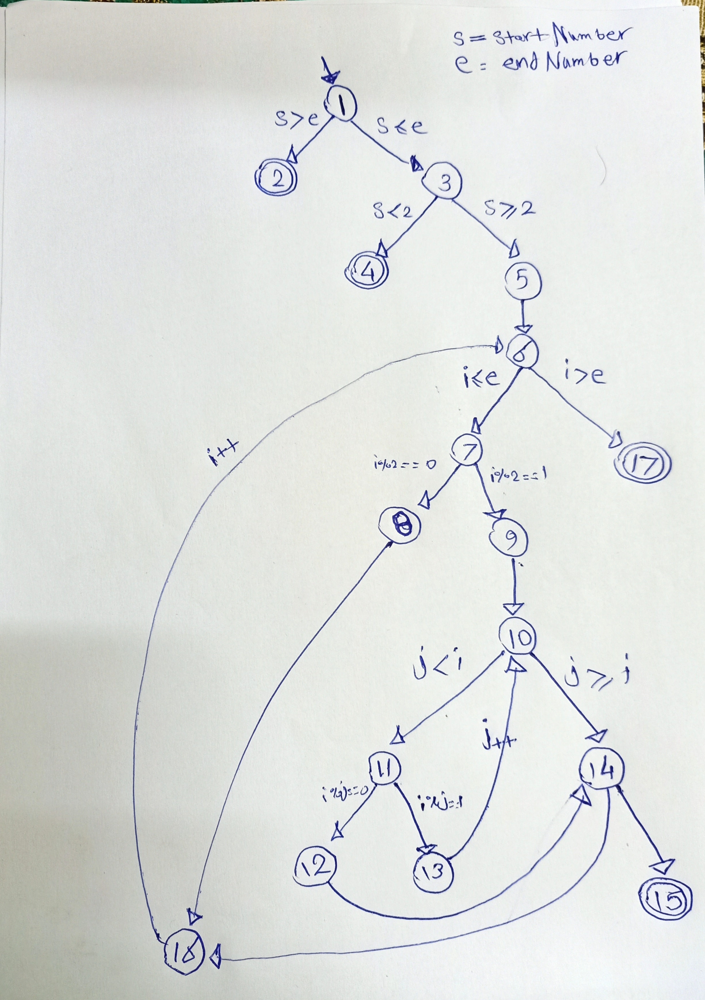

# TechBlend-Testing: Black Box and Graph Coverage Testing Techniques 

This repository contains code and documentation for performing black box testing and graph coverage analysis on software systems. Black box testing is a technique that tests the functionality of a system without knowing its internal structure or implementation. Graph coverage analysis is a technique that measures how well a set of test cases covers the possible paths or branches in a system’s control flow graph. 

## Black Box Testing

In this section, we focus on testing the `org.jfree.data.time.Quarter` class from the JFreeChart framework. The goal is to ensure that all constructors and methods of the `Quarter` class are thoroughly tested.

The following deliverables are included:

    JFreeChart.jar: A modified version of the JFreeChart library specifically for this testing.
    Libraries: A set of required libraries for compiling the JFreeChart jar file.
    QuarterClassTest.java: A sample test file that provides a passing test case.

Bugs Report provided, documenting the methods to be tested, test cases, their status (Passed or Failed), and additional notes.

### Bugs Report Example

| Method                  | Test Cases                       | Status |
| ----------------------- | -------------------------------- | ------ |
| `constructor(int, int)` | `new Quarter(2022, 3)`           | Passed |
| `getYear()`             | `new Quarter(2022, 3).getYear()` | Passed |
| ...                     | ...                              | ...    |

## Graph Coverage

In this section, we analyze a specific method using graph coverage techniques. The method code:

```
public int findTheFirstPrimeNumber(int startNumber, int endNumber)
  {
    if(startNumber > endNumber)
      return -1;

    if(startNumber < 2)
      return -1;

    for(int i = startNumber; i <= endNumber; i++)
    {
      if(i%2 == 0)
        continue;

      boolean isPrime = true;

      for(int j =2; j < i; j++)
      {
        if(i % j ==0)
        {
          isPrime = false;
          break;
        }  
    }
    if(isPrime)
      return i;
    }
    return -1;
  }
```
The deliverables for this section include:

    Text Files: Three separate text files containing the following information:
        Text file contains All nodes (comma separated) mentioning the start and end nodes, Test Paths for nodes coverage with a test case for each path.
        Text file contains All Edges (comma separated), Test Paths for edges coverage with a test case for each path.
        Text file contains Prime path coverage with a test case for each path
    Screenshot: A screenshot of the graph under analysis.

### Graph Analysis Screenshot



## Getting Started

To get started with this project, follow these steps:

1. Clone the repository: `git clone https://github.com/KhaledAshrafH/TechBlend-Testing.git`
2. Set up the necessary environment and dependencies.
3. Review the provided documentation and code files.
4. Perform black box testing for the `Quarter` class by creating your test file.
5. Analyze the graph for graph coverage and generate the required text files and screenshots.

## Contributing

Contributions to this repository are welcome. If you find any issues or have suggestions for improvement, please open an issue or submit a pull request. Your contributions can help enhance the effectiveness of black box testing and graph coverage techniques.

## Team

- [Khaled Ashraf Hanafy Mahmoud - 20190186](https://github.com/KhaledAshrafH).
- [Samah Moustafa Hussien Mahmoud - 20190248](https://github.com/Samah-20190248).

## License

This project is licensed under the [MIT License](LICENSE.md).
